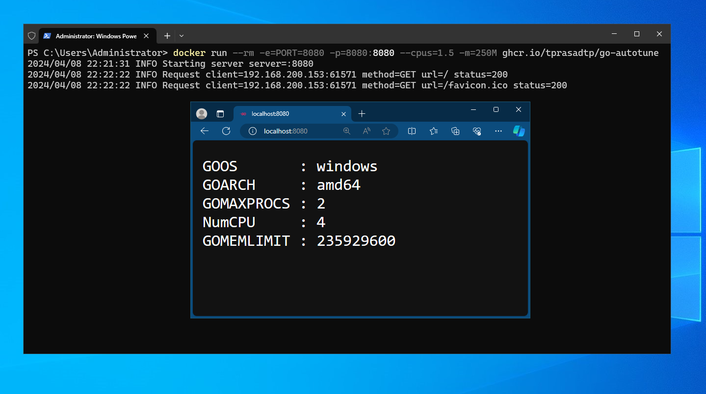

# Example

> [!IMPORTANT]
>
> This is an _example_ and is **NOT** covered by semver compatibility guarantees.

If `PORT` env variable is specified and is a valid port, a simple http server
is started on that port, listening on all available interfaces. Alternatively,
`-listen` flag can be used to specify listening address. If both are not specified,
then container simply prints `GOMAXPROCS` and `GOMEMLIMIT` values and some runtime/platform
data to stdout and exits.

## Docker (Windows)

Though this library works on Windows 10 or later and Windows 2016 or later
_example docker images_ are only provided for Server 2019, Server 2022 and Server 2025.
because of [Windows container version compatibility].

```console
docker run --rm --cpus=1.5 --memory=250M ghcr.io/tprasadtp/go-autotune
```





## Docker (Linux)

```console
docker run --rm --cpus=2 --memory=100M ghcr.io/tprasadtp/go-autotune
```


## Systemd Services

- Clone this repository.

  ```bash
  git clone --depth=1 https://github.com/tprasadtp/go-autotune
  ```

- Checkout the repository.

  ```bash
  cd go-autotune
  ```

- Build the example binary and install it to `~/.local/bin` as "go-autotune".

  ```bash
  go build -trimpath \
    -ldflags='-w -s' \
    -tags=osusergo,netgo \
    -o ~/.local/bin/go-autotune \
    github.com/tprasadtp/go-autotune/example
  ```

- Verify that CPU and memory controllers are available for user level units.
  If output does not contain strings `cpu` and `memory`, CPU controllers are not available for
  user level units. Install the binary to a root accessible location (like `/usr/local/bin`)
  and run the `systemd-run` commands without the `--user` flag.

  ```bash
  systemctl show user@$(id -u).service -P DelegateControllers
  ```

- Run the example binary as a transient unit with with resource limits applied.

  ```bash
  systemd-run -Pq --user -p "CPUQuota=150%" -p MemoryHigh=250M -p MemoryMax=300M go-autotune
  ```

  

[Windows container version compatibility]: https://learn.microsoft.com/en-us/virtualization/windowscontainers/deploy-containers/version-compatibility
