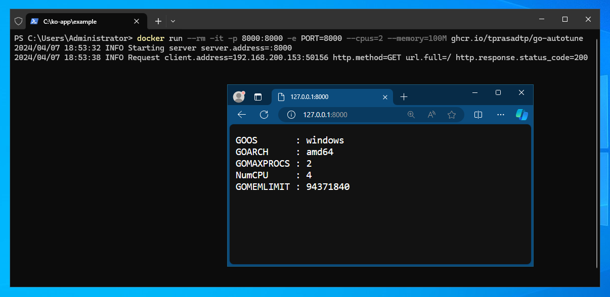
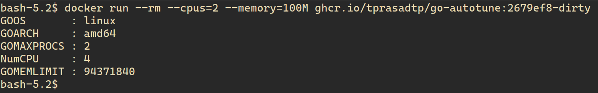

# Example

> [!IMPORTANT]
>
> This is an _example_ and is **NOT** covered by semver compatibility guarantees.

If `PORT` env variable is specified and is a valid port, a simple http server
is started on that port, listening on all available interfaces. Alternatively,
`-listen` flag can be used to specify listening address. If both are not specified,
then container simply prints `GOMAXPROCS` and `GOMEMLIMIT` values and some runtime/platform
data to stdout and exits.

## Docker (Windows)

Only Server 2019, Server 2022 and Server 2025 images/hosts are supported. See
[Windows container version compatibility] for more info.

```console
docker run --rm -it -p 8000:8000 -e PORT=8000 --cpus=2 --memory=100M ghcr.io/tprasadtp/go-autotune
```



## Docker (Linux)

Only amd64, arm64 and armv7 platforms are supported.

```console
docker run --rm --cpus=2 --memory=100M ghcr.io/tprasadtp/go-autotune
```



## Systemd Services

- Change base directory

  ```console
  cd example
  ```

- Build example go binary

  ```bash
  go build -o example example.go
  ```

- Verify CPU and Memory controller delegation is available for user level units.

  ```bash
  systemctl show user@$(id -u).service --property=DelegateControllers
  ```

  should show something like below. It **must contain** both `cpu` and `memory`.

  ```console
  DelegateControllers=cpu memory pids
  ```

- Run with with resource limits

  ```bash
  systemd-run \
    --user \
    --pipe \
    --quiet \
    --property="CPUQuota=150%" \
    --property=MemoryHigh=250M \
    --property=MemoryMax=300M \
    example
  ```

  ```
  GOOS       : linux
  GOMAXPROCS : 2
  NumCPU     : 4
  GOMEMLIMIT : 262144000
  ```

[Windows container version compatibility]: https://learn.microsoft.com/en-us/virtualization/windowscontainers/deploy-containers/version-compatibility
